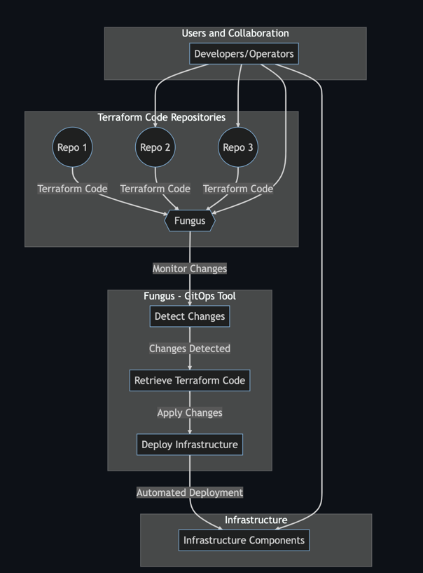

# Project using Go in AWS, SNS and SQS

## Project Summary:
This project demonstrates a minimal setup to use AWS SNS and SQS with Go. It includes examples for publishing messages to an SNS topic, subscribing an SQS queue to that topic, and consuming messages from the queue.
